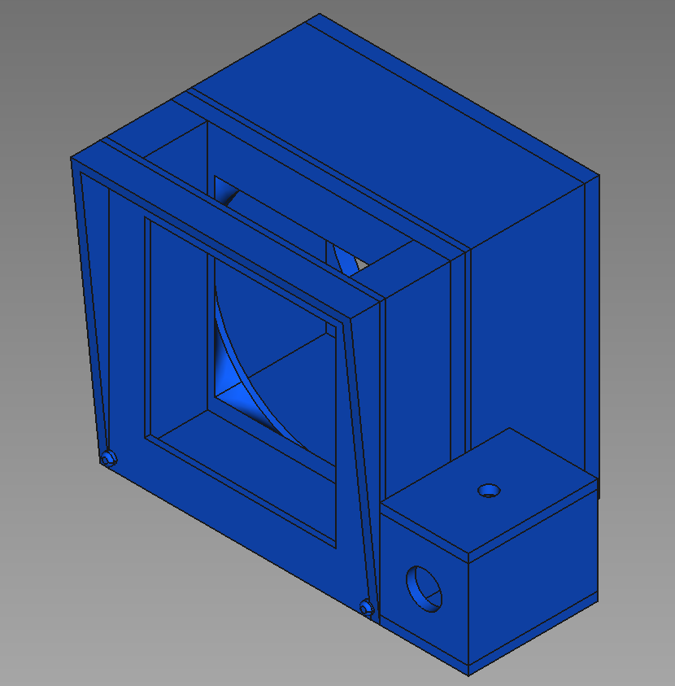
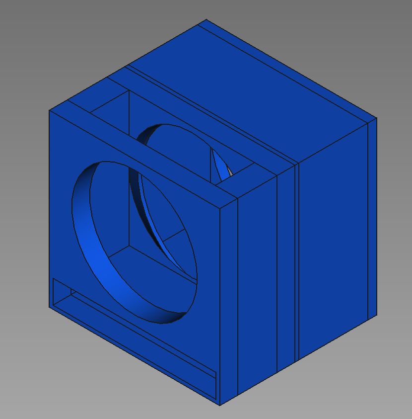

## NOTE: THIS PROJECT IS STILL A WORK-IN-PROGRESS

# Open Fume Extractor

This repository is for my personal fume extractor designs. It's still a work-in-proress.

## Current Status

Design 1 (inspired by [https://www.thingiverse.com/thing:3474360](https://www.thingiverse.com/thing:3474360)) is fully modelled but still need testing:

Design 2 (also inspired by [https://www.thingiverse.com/thing:3474360](https://www.thingiverse.com/thing:3474360)) is still a work-in-progress

## BOM:

Will add buy link to this stuff later, especially as I finalize the designs

- 80\*80\*38mm Fan
- 130\*130mm Carbon Smoke Absorber
- 5.5\*2.1mm DC Panel Jack
- SPST Rocker Switch with ON/OFF plate
- 5mm LED
- 1k resistor
- 24v or 12v power supply (depending on fan voltage)
